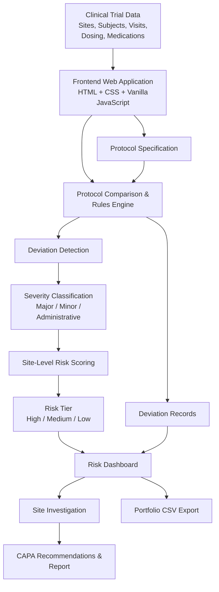

# Architecture

## System Architecture



## Components
Copy `.env.example` to `.env` and fill in the values:

```bash
cp .env.example .env
```

| **Component**     | **Technology**                  | **Responsibility**|

| **Frontend**      | HTML, CSS, Vanilla JavaScript   | Dashboard UI, site search/filtering, risk visualization, site investigation                       |
| **Backend API**   | None — Client-side JavaScript   | Protocol comparison, deviation detection, severity classification, risk calculation               |
| **AI / ML**       | IBM Bob AI                      | AI-assisted solution development and innovation workflow                                          |
| **Database**      | None — Simulated/In-memory data | Generates and holds simulated clinical trial sites, subjects, visits, medications, and deviations |
| **Notifications** | None                            | Risk indicators and dashboard alerts for high-risk sites                                          |

## Data Flow

1. Clinical trial data is created and stored in the website.
2. The data is checked with the given clinical trial protocol.
3. The system finds problems like wrong doses, missed visits, or restricted medicines.
4. Each problem is marked as Major, Minor, or Administrative.
5. The system calculates a risk score for each site.
6. The results are shown on the dashboard.
7. Users can check a site and see its problems and risk level.
8. The system can generate a CAPA report and export the data as a CSV file.

## Security Considerations

1. No sensitive patient information is used; the project uses simulated clinical trial data.
2. No API keys or passwords are stored in the code.
3. The project does not use a database or external authentication system.
4. The application is deployed as a static website, so there is no backend server to expose.
5. In a real-world version, patient data, authentication, API security, and secure database storage would be added.

## Scalability Notes

1. The current project can handle multiple clinical trial sites and patient records.
2. The system can be extended to support more sites and larger amounts of data.
3. More protocol rules and deviation types can be added when needed.
4. In the future, a backend and database can be added to store large amounts of clinical trial data.
5. The current prototype can be connected to real clinical trial systems for real-time monitoring
